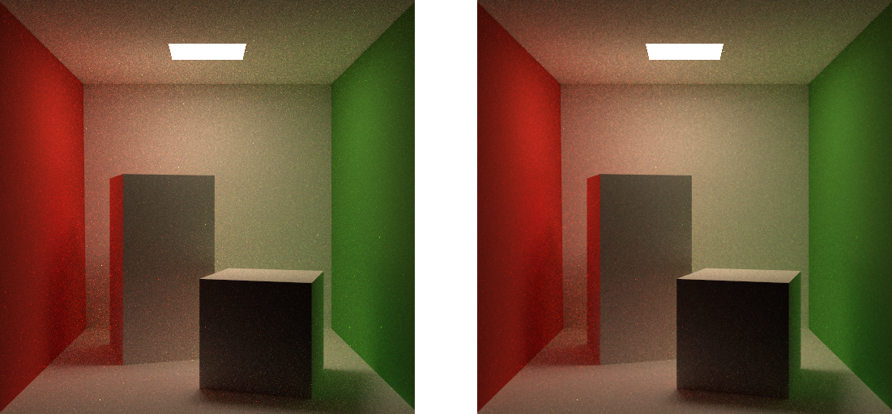

# V-PathTracer：可视化路径追踪渲染器

<div>
  <a href="https://github.com/zilize/V-PathTracer">
    
  </a>
  <a href="./LICENSE">
    
  </a>
  <a href="https://moecode.com">
    
  </a>
</div>


- [概述](#概述)
- [结果演示](#结果演示)
- [性能提升](#性能提升)
- [代码结构](#代码结构)
- [项目运行](#项目运行)
- [参考文献](#参考文献)

## 概述

夏日炎炎，不如渲染个冷色调的 Cornell Box 来冰爽一夏！为了能够实时观察渲染结果的收敛过程，我花了一周多实现了一个基于图形界面的可视化路径追踪渲染器 V-PathTracer。

V-PathTracer 有如下特性：

- 基于 NanoGUI 实现，可实时观察每一个 SPP 的更新结果
- 内置经典场景 Cornell Box 与 Stanford Bunny
- 实现了漫反射、镜面反射、Cook-Torrance 微表面模型三种材质
- 多线程加速渲染，进度条让等待不再枯燥
- 动态空间加速结构 SAH 赋能 92.3 倍提速
- 提供高斯模糊、联合双边滤波等图像空间处理方案
- 可视化深度、法线、反射率、位置等屏幕空间 G-Buffer


## 结果演示

首先展示经典场景 Cornell Box 的最终渲染结果，在 MacBook Pro 设备上 16 线程和 SAH 空间加速结构的加持下，耗时 14 分钟，完成 768 * 768 分辨率 1024 SPP 的渲染。


V-PathTracer 实现了 Outlier Removal 功能，在图像空间上去除与周围环境颜色差异过大的点。具体来说是在 3 * 3 九宫格范围内计算出颜色的平均值 $\mu$ 以及标准差 $\sigma$，将当前像素颜色截断到范围 $[\mu - \sigma, \mu + \sigma]$。

下面展示的是不同实验设置下原始图像与 Outlier Removal 后的图像对比，它们共享的实验设置为 256 SPP 与 512 * 512 分辨率。其中，镜面反射材质在 256 SPP 下发生了崩坏，看起来并不是那么容易收敛。

Cornell Box，Diffuse 材质：



Stanford Bunny，Diffuse 材质：


Cornell Box，Cook-Torrance BRDF，Roughness = 0.20：


Cornell Box，Cook-Torrance BRDF，Roughness = 0.25：


Cornell Box，Cook-Torrance BRDF，Roughness = 0.30：


Cornell Box，Cook-Torrance BRDF，Roughness = 0.35：


Cornell Box，镜面反射材质：


接下来再来看看 Cornell Box 和 Stanford Bunny 场景下的 G-Buffer。由于光线是从像素中心点直接出发的 1 SPP 绘制结果，所以会有明显的锯齿感。

深度图：


法线图：


Albedo 反射率图：


位置图：


## 性能提升

V-PathTracer 除了能进行多线程运行，还实现了多个层次的空间加速结构，便于进行性能对比。空间加速结构能加速光线与场景中大量三角形求交的过程，最直观的做法是暴力求解，遍历每一个三角形判断相交与否。

除了 Brute Force 手段，V-PathTracer 还实现了两种不同启发式方案的 BVH (Bounding Volume Hierarchy)，一种是基于包围盒最长轴进行三角形数量平分的方案，另一种是使得划分包围盒后的面积尽可能小的方案，后者被称为 SAH (Surface Area Heuristic)。

V-PathTracer 使用自顶向下的递归方法来构建三角形数量平分的 BVH，使用递增式的算法实现动态的 SAH。递增式的算法意味着一步步向二叉树结构中插入新的三角形面元，动态的 SAH 意味着加速结构能够随时根据场景的变化来插入和删除三角形面元。动态的 SAH 实现参考了 Box2d 在 GDC 2019 上的工作 [Dynamic Bounding Volume Hierarchies](https://box2d.org/publications/)。

为了演示空间加速结构的效果，在单线程设定下统计构建加速结构和构建所有 G-Buffer的时长：

|  加速结构   | 耗时统计 |
| :---------: | :------: |
| Brute Force | 14867ms  |
|     BVH     |  3725ms  |
|     SAH     |  161ms   |

## 代码结构

项目代码在 GitHub 上公开：[https://github.com/Zilize/V-PathTracer](https://github.com/Zilize/V-PathTracer)

根目录下包含若干目录：

- `ext`：项目依赖的外部库，只有`NanoGUI`和仿 OpenGL 的数学库`glm`。
- `model`：放置模型`Cornell Box`和`Stanford Bunny`，均为`obj`格式文件。
- `cache`：存放初始化封面图`init.png`，每次渲染完成后会输出渲染结果`framebuffer.png`，如果设置了图像空间滤波功能，还会输出滤波后的结果`framebufferAfterFilter.png`。
- `include`：项目所包含的头文件，其中`obj_loader.h`来自开源单个头文件库[OBJ_Loader](https://github.com/Bly7/OBJ-Loader)。
- `src`：项目的 C++ 源码。

项目基于 C++ 开发，除了外部库与`include`中的`obj_loader.h`头文件，源码约有 2000 行。如果你要阅读源码，可以参考下面的关键点与概念解析：

- 程序从`main.cpp`进入`application.cpp`，实现所有的图形界面逻辑。当用户完成配置并点击开始按钮，便会进入`Application::run`函数，这里新建了一个线程管理渲染逻辑，避免图形界面发生阻塞。

- `Application`对象中维护着一个渲染器对象`renderer`，每次点击按钮后都会重新初始化其中的内容，包括构建空间加速结构和 G-Buffer。

- 场景中的每个三角形面元抽象为一个`Triangle`对象，同一个物体的所有面元集成到一个`Object`对象中，所有`Object`以及空间加速结构会由`Scene`对象来统一管理，并向渲染器对象提供外部接口。目前`Object`类只是一个包装类，没有什么实际的功能，后续可添加对物体的变换接口。

- 每个三角形面元会通过共享指针指向特定的材质`Material`，材质提供了两个接口。接口`reflect`用于对入射的光线方向和法线方向进行采样得到出射的光线方向，以及对应的概率密度函数值；接口`brdf`能够根据输入的入射、出射与法线方向计算与材质相关的双向反射分布函数值。

- `Scene`对象中实现了主要的路径追踪逻辑`shade`递归函数。根据材质的不同类型，实现了`shadeDiffuse`、`shadeMirror`、`shadeMicrofacet`三个接口，便于对各类材质进行相应的优化。

- V-PathTracer 实现的微表面材质实际上是漫反射与 Cook-Torrance BRDF 的结合体。在对光源进行直接采样时，使用的是类 Diffuse 的方法，在计算普通的反射时才用了 Cook-Torrance BRDF 的分布。实现时并没有使用`Material`提供的`reflect`接口，而用的`brdf`接口也仅仅是提供给对光源直接进行采样使用的，类 Diffuse 的 BRDF。该写法并不优雅。

- 对光源进行直接采样能够有效提升渲染效率，降低画面的噪点密度。因此实现了对光源进行采样的 Diffuse 和 Microfacet 材质渲染结果良好，而没有对光源直接进行采样的 Mirror 材质收敛更困难，正如上面的实验结果所展示的。如果你想更直观地体验一下，可以在`shadeDiffuse`函数中只保留直接对光源采样的部分，这样相当于只有直接光照。也可以删除对光源直接进行采样的部分，同时修改普通反射面采样的条件控制（不然就没有光源了），看看暴力采样的效果，如下图所示是 300 SPP 的结果。

  

## 项目运行

要编译运行项目，需要你的设备已经安装好 CMake 与 OpenGL。本指南适用于 macOS。

首先从 GitHub 克隆项目到本地，由于项目以子模块的方式链接了外部库，所以要以递归方式克隆：

```
git clone --recursive --depth=1 https://github.com/Zilize/V-PathTracer.git
```

进入项目目录并开始准备构建环境：

```
cd V-PathTracer
mkdir build
cd build
cmake ..
make
```

等待几分钟的编译后，运行项目`vpathtracer`：

```
./vpathtracer
```

## 参考文献

[1]. [GAMES101：现代计算机图形学入门](https://sites.cs.ucsb.edu/~lingqi/teaching/games101.html)

[2]. [GAMES202：高质量实时渲染](https://sites.cs.ucsb.edu/~lingqi/teaching/games202.html)

[3]. [Real Shading in Unreal Engine 4](https://cdn2.unrealengine.com/Resources/files/2013SiggraphPresentationsNotes-26915738.pdf)

[4]. [Dynamic Bounding Volume Hierarchies](https://box2d.org/files/ErinCatto_DynamicBVH_Full.pdf)

[5]. [Ray Tracing in One Weekend - The Book Series](https://raytracing.github.io/)

[6]. [Hammersley Points on the Hemisphere](http://holger.dammertz.org/stuff/notes_HammersleyOnHemisphere.html)

[7]. [草履虫也能看懂的Cook-Torrance BRDF](https://zhuanlan.zhihu.com/p/473834300)

